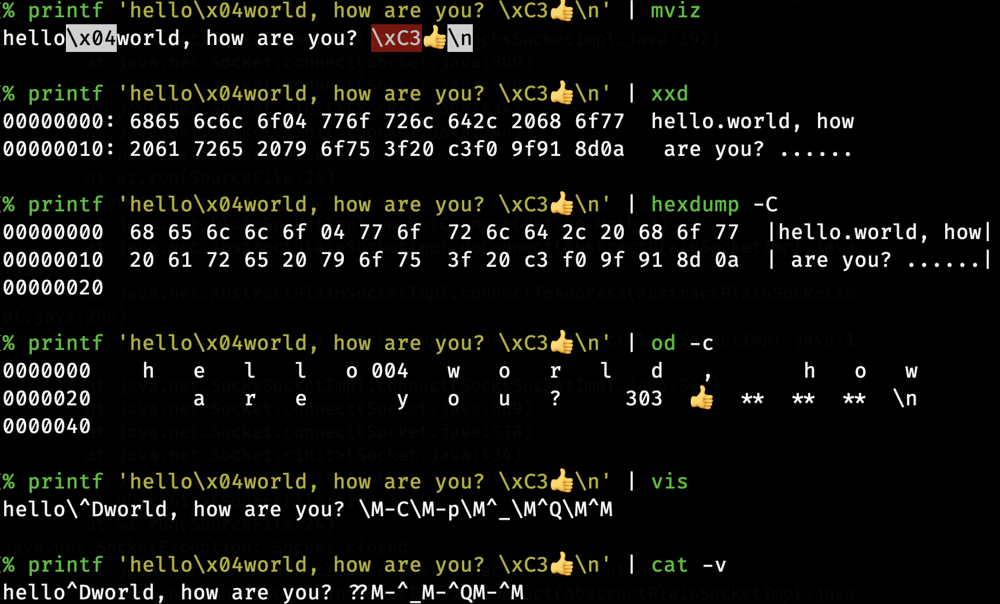

# The `mviz` command
A modern alternative to `vis`: a way visualize invisible and invalid bytes in different encodings.

`mviz` is essentially a replacement for interactive use of `echo` or `cat`: Instead of `echo "$variable"` or `cat file.txt`, which (on most terminals) hide invisible characters (like `\x01`), you instead do `mviz "$variable"` or `mviz -f file.txt`.

# Examples
`mviz` is designed with sensible defaults in mind; its default behaviour is what you want most of the time, but it can easily (and sensibly) be changed with options

Hm... let's try inspecting a variable


What else can `mviz` do?


It's even usable with pipes!


<!--
```sh
$ mviz "$variable"        # See the contents of a shell variable
$ mviz -d "$variable"     # Delete weird characters from the variable
$ mviz -f file.txt        # Print file.txt, escaping "weird" characters
$ mviz -fw file.txt       # Like the previous line, but newlines and tabs aren't escaped.
$ some_command | mviz     # Visualize weird characters of `some_command`
$ some_command | mviz -l  # Like the previous one, but don't escape newlines.
$ some_command | mviz -b  # Interpret input data as binary, not UTF-8 (the default)
```
greeting=$'\rHello\x01, world 🌍! '
some_command () { print $'Not\u00A0much.\r\ncool!' }
PROMPT_EOL_MARK=

echo "$greeting" # Everything _seems_ to be in order...
mviz "$greeting"    # But it's not!

mviz -r "$greeting" # Replace with �
mviz -C "$greeting" # Use control pictures!
mviz -m "$greeting" # Escape UTF-8!

some_command | mviz      # Pipe stuff in!
some_command | mviz -l   # Don't escape newlines!
some_command | mviz -dD  # Delete invalid characters!
some_command | mviz -b   # Interpret the input as binary data!
some_command | mviz -abx # Show the hex of _all_ bytes!
-->

It's also quite useful when you're learning how shells work:
```bash
# See what files are expanded by a glob
$ mviz [A-Z]*
    1: LICENSE
    2: README.md
# See how `$variable` word splits
$ variable='hello    world,   :-)'
$ mviz $variable
    1: hello
    2: world,
    3: :-)
# See how `$IFS` affects it
$ IFS=o
$ mviz $variable
    1: hell
    2:     w
    3: rld,   :-)
```

Try `mviz -h` for short usage, and `mviz --help` for the longer one.

# Why not use tool X (`xxd`, `hexdmp`, `vis`, `od`, etc)?
The biggest difference between `mviz` and other tools is that `mviz` is intended for looking at mostly-normal text by default, and optimizes for that. It doesn't change the output _unless_ weird characters exist. For example:


<!-- ```bash
% printf 'hello\x04world, how are you? \xC3👍\n' | mviz
hello\x04world, how are you? \xC3👍\n

% printf 'hello\x04world, how are you? \xC3👍\n' | xxd
00000000: 6865 6c6c 6f04 776f 726c 642c 2068 6f77  hello.world, how
00000010: 2061 7265 2079 6f75 3f20 c3f0 9f91 8d0a   are you? ......

% printf 'hello\x04world, how are you? \xC3👍\n' | hexdump -C
00000000  68 65 6c 6c 6f 04 77 6f  72 6c 64 2c 20 68 6f 77  |hello.world, how|
00000010  20 61 72 65 20 79 6f 75  3f 20 c3 f0 9f 91 8d 0a  | are you? ......|
00000020

% printf 'hello\x04world, how are you? \xC3👍\n' | od -c
0000000    h   e   l   l   o 004   w   o   r   l   d   ,       h   o   w
0000020        a   r   e       y   o   u   ?     303  👍  **  **  **  \n
0000040

% printf 'hello\x04world, how are you? \xC3👍\n' | vis
hello\^Dworld, how are you? \M-C\M-p\M^_\M^Q\M^M

% printf 'hello\x04world, how are you? \xC3👍\n' | cat -v
hello^Dworld, how are you? ??M-^_M-^QM-^M
```
 -->
In addition, `mviz` by default adds a "standout marker" to escaped characters (by default, it inverts the foreground and background colours), so they're more easily distinguished at a glance.

# How it works
The way `mviz` works at a high-level is pretty easy: Every character in an input is checked against the list of patterns, and the first one that matches is used. If no patterns match, the character is checked against the "default pattern," and if that doesn't match, the character is printed verbatim.

To simplify the most common use-case of `mviz`, where only the "escaping mechanism" (called an "Action"; see below) is changed, a lot of short-hand flags (such as `-x`, `-d`, etc.) are provided to just change the default action.

`mviz` is broken into three configurable parts: The encoding of the input data, the "patterns" to match against the input data, and the action to take when a pattern matches. They're described in more details below:

## Encodings
The encoding (which can be specified via `--encoding`, and are case-insensitive) is used to determine which input bytes are valid, and which are invalid.

Valid bytes (which differ between encodings, see below) are then matched against patterns as described in `How it works`. However, "invalid bytes" (for example `\xC3` in UTF-8) are handled specially:

By default, these bytes have their hex values printed out (but this can be changed, e.g. with `--invalid-action=delete`), along with a different "standout" pattern than normal escapes (by default, a red background). If any invalid bytes are encountered during an execution, and `--malformed-error` is set (which it is by default), the program will exit with a non-zero exit code at the end.

You can get a list of all the supported encodings via `--list-encodings`. Non-ASCII-compliant encodings, such as `UTF-16`, aren't supported (as they drastically complicate character matching logic).

The "binary" encoding (which can be specified either with `--encoding=binary` or the `-b` / `--binary` / `--bytes` shorthands) is unique in that it doesn't have any "invalid bytes."

Unless explicitly specified (either via `--encoding`, or one of the shorthands like `-b`), the encoding normally defaults to `UTF-8`. However, if the environment variable `POSIXLY_CORRECT` is set, it defaults to the "locale" encoding, which relies on the environment variables `LC_ALL`, `LC_CTYPE`, and `LANG` (in that order) to specify it.

## Patterns
Patterns are a sets of characters (internally using regular expression character classes—`[a-z]`) that are used to match against input characters. In addition to specifying "normal" escape sequences (eg `\n` for newlines, `\xHH` for hex escapes, and `\u{HHHH}` for Unicode codepoints, `\w` for "word characters", etc), patterns also support the following custom escape sequences:

- `\A` matches all characters
- `\N` matches no characters
- `\m` matches multibyte characters (and is only useful if the input encoding is multibyte, like UTF-8)
- `\M` matches single-byte characters (ie anything `\m` doesn't match)
- `\@` matches the "default pattern" (see below)

Patterns are normally used when specifying actions directly (eg `mviz --delete=^a-z` will only output lower-case letters).

### Default Pattern
The default pattern is the pattern that is checked _after_ all "user-specified patterns." If it matches, the "default action" takes place (which are controlled by shorthands like `-x`, `-o`, etc.) acts upon.

Normally, the default pattern is just `\x00-\x1F\x7F`—that is, all of the control bytes in ASCII. However, there's a few ways it can be changed:
1. It can be explicitly set via `--default-pattern=PATTERN`, at which point that's exactly what'll be used.
2. If encoding is `BINARY`, the bytes `\x80-\xFF` are also added, as the binary encoding considers all bytes to be valid.
3. If the encoding is `UTF-8` (the default, unless `POSIXLY_CORRECT` is set), then the codepoints `\u0080-\u009F` are added.
3. If the default action is unchanged, and visual effects aren't be used, then backslash (`\`) is added to the default pattern. This way, it'll be escaped when "standout features" aren't in use.

## Actions
Actions are how characters are escaped. There's a lot of them, and they can be used either as arguments to flags (eg `--invalid-action=octal`) or specified explicitly (eg via `--highlight=a-z`):

| Name | Description |
|------|-------------|
| `print`     | Print characters, unchanged, without escaping them. Unlike the other actions, using `print` will not mark values as "escaped" for the purposes of `--check-escapes` |
| `delete`    | Delete characters from the output by not printing anything. Deleted characters are considered "escaped" for the purposes of `--check-escape` |
| `dot`       | Replaces characters by simply printing a single period (`.`). *Note*: Multibyte characters are still represented by a single period. |
| `replace`   | Identical to `dot`, except instead of a period, the replacement character, � (`\uFFFD`) is printed instead. |
| `hex`       | Replaces characters with their hex value (`\xHH`). Multibyte characters will have each of their bytes printed. |
| `octal`     | Like `--hex`, except octal escapes (`\###`) are used instead. The output is always padded to three bytes (so NUL is `\000`, not `\0`) |
| `picture`   | Print out "[control pictures](https://en.wikipedia.org/wiki/Control_Pictures)" (`U+240x`-`U+242x`) corresponding to the character. *Note*: Only `\x00`–`\x20` and `\x7F` have control pictures assigned to them, and using `picture` with any other characters will yield a warning (and fall back to `hex`). |
| `codepoint` | Replaces chars with their UTF-8 codepoints (`\u{HHHH}`). This only works if the encoding is UTF-8. *Note:* This cannot be used with `--invalid-action`, as invalid bytes don't have a codepoint. |
| `highlight` | Prints the character unchanged, but considers it "escaped". (Thus, visual effects are added to it like any other escape, and `--check-escapes` considers it an escaped character.) |
| `c-escape`  | Print out C-style escapes for the following characters: `0x07` (`\a`), `0x08` (`\b`), `0x09` (`\t`), `0x0a` (`\n`), `0x0b` (`\v`), `0x0c` (`\f`), `0x0d` (`\r`), `0x1b` (`\e`), `0x5c` (`\\`). *Note*: Using `c-escape` with any other character will yield a warning (and fall back to `hex`). |
| `default`   | Use the default pattern: All valid `c-escape` characters have their escape printed (with the sole exception that a backslash is printed as-is if visual effects are enabled), all other characters in `\x00-\x1F`, `\x7F` (and `\x80-\xFF` if the encoding is binary) are printed in hex, in `UTF-8` the codepoints `\u0080-\u009F` have their codepoints printed, and all other characters are printed as-is.|

# Environment Variables
The `mviz` command has numerous environment variables it relies on:

| Variable | Description |
|----------|-------------|
| `FORCE_COLOR`, `NO_COLOR` | Controls `--color=auto`. If FORCE_COLOR is set and nonempty, acts like `--color=always`. Else, if NO_COLOR is set and nonempty, acts like `--color=never`. If neither is set to a non-empty value, `--color=auto` defaults to `--color=always` when stdout is a tty. |
| `POSIXLY_CORRECT` | If present, changes the default `--encoding` to be `locale` (cf locale(1).), and also disables parsing switches after arguments (e.g. passing in `foo -x` as arguments will not interpret `-x` as a switch). |
| `P_STANDOUT_BEGIN`, `P_STANDOUT_END` | Beginning and ending escape sequences for --colour; Usually don't need to be set, as they have sane defaults. |
| `P_STANDOUT_ERR_BEGIN`, `P_STANDOUT_ERR_END` | Like `P_STANDOUT_BEGIN`/`P_STANDOUT_END`, except for invalid bytes (eg `\xC3` in UTF-8) |
| `LC_ALL`, `LC_CTYPE`, `LANG` | Checked (in that order) for the encoding when `--encoding=locale` is used. |

# Contributions
Bugs are welcome!
